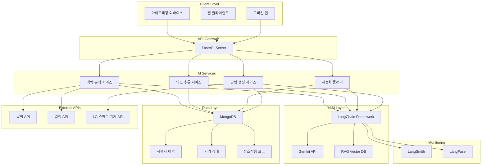

# GazeHome AI 서버 아키텍처 문서

## 📋 개요

GazeHome AI 서버는 시선으로 제어하는 스마트 홈을 위한 AIoT 통합 솔루션입니다. 아이트래킹 기술과 대형 언어 모델을 결합하여 사용자의 시선만으로 LG 스마트 가전 및 다양한 IoT 기기를 직관적으로 제어할 수 있습니다.

### 🔄 시스템 변경 사항 (2025-10-08 업데이트)

**변경 개요**: x, y 좌표 기반 시선 추적 → **클릭된 IoT 기기 정보 직접 수신** 방식으로 전환

- **이전**: 하드웨어에서 x, y 좌표를 전송하면 AI 서버가 어떤 기기를 보는지 판단
- **현재**: 하드웨어에서 이미 "에어컨을 클릭했다"와 같은 IoT 기기 정보를 처리하여 전송
- **장점**: 
  - 하드웨어와 AI 서버 간 역할 분리 명확화
  - AI 서버는 의도 추론 및 추천에만 집중
  - 더 정확한 기기 식별 가능

## 🏗️ 전체 아키텍처



## 📁 프로젝트 구조

```
ai-services/
├── app/                          # 메인 애플리케이션
│   ├── api/                      # API 레이어
│   │   ├── endpoints/            # API 엔드포인트
│   │   │   ├── gaze.py          # 시선 제어 API
│   │   │   ├── context.py       # 맥락 분석 API
│   │   │   ├── automation.py    # 자동화 API
│   │   │   └── devices.py       # 기기 제어 API
│   │   └── router.py            # API 라우터
│   ├── core/                     # 핵심 설정
│   │   ├── config.py            # 환경 설정
│   │   └── database.py          # 데이터베이스 연결
│   ├── models/                   # 데이터 모델
│   │   ├── user.py              # 사용자 모델
│   │   └── device.py            # 기기 모델
│   ├── services/                 # 비즈니스 로직
│   │   └── llm_service.py       # LLM 서비스
│   ├── utils/                    # 유틸리티
│   │   └── logger.py            # 로깅 유틸리티
│   └── main.py                  # FastAPI 애플리케이션
├── Docs/                         # 문서
│   ├── git_convention.md        # Git 컨벤션
│   ├── venv_and_requirements_guide.md  # 환경 설정 가이드
│   └── gazehome_architecture.md # 아키텍처 문서 (현재 파일)
├── requirements.txt              # Python 의존성
├── .env.example                 # 환경 변수 예시
├── main.py                      # 메인 진입점
└── README.md                    # 프로젝트 개요
```

## 🔧 핵심 컴포넌트

### 1. API Layer (`app/api/`)

#### 시선 제어 API (`gaze.py`)
- **기능**: 클릭된 IoT 기기 정보 수신 및 LLM 기반 추천 생성
- **엔드포인트**:
  - `POST /api/gaze/click` - 클릭된 기기 정보 수신 및 추천 생성 (주요)
  - `GET /api/gaze/status` - 시선 추적 시스템 상태 확인
- **처리 흐름**:
  1. 하드웨어로부터 클릭된 기기 정보 수신
  2. LLM Agent를 통한 의도 추론
  3. 시간대, 기기 상태 등을 고려한 최적 명령어 추천
  4. 하드웨어로 추천 정보 반환

#### 맥락 분석 API (`context.py`)
- **기능**: 사용자 상황 및 환경 분석
- **엔드포인트**:
  - `POST /api/context/analyze` - 맥락 및 상황 분석
  - `POST /api/context/intent` - 의도 추론
  - `GET /api/context/history/{user_id}` - 사용자 맥락 이력 조회

#### 자동화 API (`automation.py`)
- **기능**: 최적 제어 시나리오 설계 및 실행
- **엔드포인트**:
  - `POST /api/automation/plan` - 최적 제어 시나리오 설계
  - `GET /api/automation/scenarios/{user_id}` - 사용자 자동화 시나리오 조회
  - `POST /api/automation/execute/{scenario_id}` - 자동화 시나리오 실행

#### 기기 제어 API (`devices.py`)
- **기능**: IoT 기기 제어 및 상태 관리
- **엔드포인트**:
  - `GET /api/devices/` - 등록된 기기 목록 조회
  - `GET /api/devices/{device_id}` - 특정 기기 정보 조회
  - `POST /api/devices/control` - 기기 제어
  - `GET /api/devices/{device_id}/status` - 기기 상태 조회

### 2. Core Layer (`app/core/`)

#### 설정 관리 (`config.py`)
- **Pydantic Settings**를 사용한 환경 변수 관리
- **주요 설정**:
  - MongoDB 연결 정보
  - Gemini API 키
  - Vector DB 경로
  - LangSmith/LangFuse 설정
  - 외부 API 키들

#### 데이터베이스 연결 (`database.py`)
- **Motor**를 사용한 비동기 MongoDB 연결
- **연결 관리**: 애플리케이션 생명주기에 따른 연결/해제

### 3. Data Models (`app/models/`)

#### 사용자 모델 (`user.py`)
```python
class User(BaseModel):
    user_id: str
    name: str
    email: Optional[str]
    preferences: Dict[str, Any]
    created_at: datetime
    updated_at: datetime

class UserInteraction(BaseModel):
    user_id: str
    interaction_type: str  # gaze, voice, touch
    data: Dict[str, Any]
    context: Dict[str, Any]
    result: Optional[Dict[str, Any]]
    timestamp: datetime
```

#### 기기 모델 (`device.py`)
```python
class Device(BaseModel):
    device_id: str
    name: str
    type: str  # light, tv, air_conditioner, etc.
    brand: str
    location: Optional[str]
    status: str
    capabilities: List[str]
    settings: Dict[str, Any]
    user_id: str

class DeviceCommand(BaseModel):
    device_id: str
    user_id: str
    action: str
    parameters: Dict[str, Any]
    status: str  # pending, executing, completed, failed
    result: Optional[Dict[str, Any]]
    timestamp: datetime
```

### 4. Services Layer (`app/services/`)

#### LLM 서비스 (`llm_service.py`)
- **LangChain**과 **Gemini API** 연동
- **주요 기능**:
  - 의도 분석 (`analyze_intent`)
  - 맞춤형 명령 생성 (`generate_command`)
  - 맥락 분석 (`analyze_context`)

### 5. Utils Layer (`app/utils/`)

#### 로깅 유틸리티 (`logger.py`)
- **한국 표준시(KST)** 지원
- **구조화된 로깅** 포맷
- **로그 레벨** 설정 가능

## 🔄 데이터 흐름

### 1. 시선 제어 플로우
```
아이트래킹 디바이스 → 시선 데이터 수신 → 맥락 분석 → 의도 추론 → 명령 생성 → 기기 제어 → 결과 저장
```

### 2. 맥락 분석 플로우
```
사용자 데이터 + 환경 데이터 + 외부 API → 맥락 분석 → 패턴 인식 → 추천 생성
```

### 3. 자동화 플로우
```
트리거 감지 → 조건 확인 → 시나리오 실행 → 결과 모니터링 → 피드백 수집
```

## 🗄️ 데이터베이스 설계

### MongoDB 컬렉션 구조

#### `users` 컬렉션
- 사용자 기본 정보
- 선호도 설정
- 계정 관리

#### `devices` 컬렉션
- 기기 등록 정보
- 기기 상태
- 기기 설정

#### `interactions` 컬렉션
- 사용자 상호작용 이력
- 시선 데이터
- 명령 실행 결과

#### `automation_scenarios` 컬렉션
- 자동화 시나리오
- 실행 이력
- 성능 메트릭

#### `context_history` 컬렉션
- 맥락 분석 결과
- 패턴 데이터
- 학습 데이터

## 🔌 외부 연동

### 1. LLM 서비스
- **Google Gemini API**: 대형 언어 모델
- **LangChain**: LLM 프레임워크
- **RAG (Vector DB)**: 검색 증강 생성

### 2. 모니터링 서비스
- **LangSmith**: LLM 추론 모니터링
- **LangFuse**: LLM 성능 분석

### 3. 외부 API
- **날씨 API**: 환경 정보 수집
- **일정 API**: 사용자 일정 정보
- **LG 스마트 기기 API**: 기기 제어

## 🚀 배포 및 운영

### 개발 환경
```bash
python main.py
```

### 프로덕션 환경
```bash
uvicorn app.main:app --host 0.0.0.0 --port 8000 --workers 4
```

### 환경 변수
- `.env` 파일을 통한 설정 관리
- 보안 정보는 환경 변수로 분리
- 개발/프로덕션 환경별 설정

## 📊 모니터링 및 로깅

### 로깅 전략
- **구조화된 로깅**: JSON 형태의 로그
- **한국 시간대**: 모든 로그는 KST로 표시
- **로그 레벨**: DEBUG, INFO, WARNING, ERROR

### 모니터링 지표
- **API 응답 시간**
- **LLM 추론 성능**
- **기기 제어 성공률**
- **사용자 만족도**

## 🔒 보안 고려사항

### API 보안
- **CORS 설정**: 허용된 도메인만 접근
- **인증/인가**: JWT 토큰 기반
- **Rate Limiting**: API 호출 제한

### 데이터 보안
- **개인정보 암호화**: 민감한 사용자 데이터
- **API 키 관리**: 환경 변수를 통한 안전한 관리
- **데이터베이스 접근 제어**: 역할 기반 접근

## 🧪 테스트 전략

### 단위 테스트
- 각 모듈별 독립 테스트
- Mock을 활용한 외부 의존성 격리

### 통합 테스트
- API 엔드포인트 테스트
- 데이터베이스 연동 테스트

### 성능 테스트
- 부하 테스트
- 응답 시간 측정

## 📈 확장성 고려사항

### 수평적 확장
- **로드 밸런싱**: 여러 인스턴스 배포
- **데이터베이스 샤딩**: 대용량 데이터 처리

### 수직적 확장
- **캐싱**: Redis를 활용한 성능 향상
- **비동기 처리**: Celery를 활용한 백그라운드 작업

## 🔄 버전 관리

### API 버전 관리
- 현재는 단일 버전으로 운영
- 향후 필요시 버전 관리 전략 수립

### 데이터베이스 마이그레이션
- **Alembic**을 활용한 스키마 관리
- **백워드 호환성** 유지

---

이 문서는 GazeHome AI 서버의 전체적인 아키텍처와 구조를 설명합니다. 프로젝트 진행에 따라 지속적으로 업데이트될 예정입니다.
